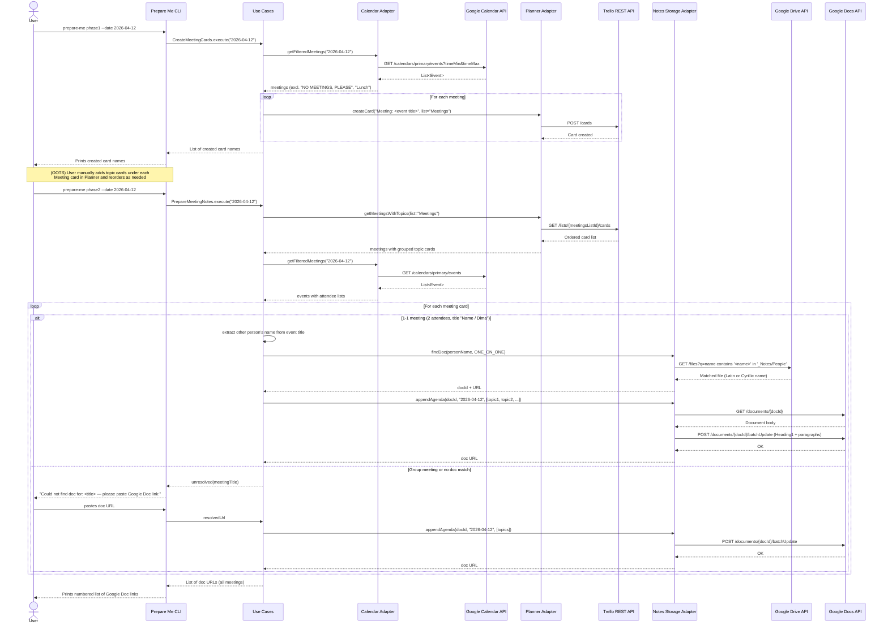

# Sequence Diagram — Basic Flow

```mermaid
sequenceDiagram
    actor User
    participant CLI as Prepare Me CLI
    participant UC as Use Cases
    participant Cal as Calendar Adapter
    participant GCal as Google Calendar API
    participant Planner as Planner Adapter
    participant TrelloAPI as Trello REST API
    participant Notes as Notes Storage Adapter
    participant DriveAPI as Google Drive API
    participant DocsAPI as Google Docs API

    %% ── PHASE 1 ──────────────────────────────────────────────────────────────
    User->>CLI: prepare-me phase1 --date 2026-04-12
    CLI->>UC: CreateMeetingCards.execute("2026-04-12")

    UC->>Cal: getFilteredMeetings("2026-04-12")
    Cal->>GCal: GET /calendars/primary/events?timeMin&timeMax
    GCal-->>Cal: List<Event>
    Cal-->>UC: meetings (excl. "NO MEETINGS, PLEASE", "Lunch")

    loop For each meeting
        UC->>Planner: createCard("Meeting: <event title>", list="Meetings")
        Planner->>TrelloAPI: POST /cards
        TrelloAPI-->>Planner: Card created
    end

    UC-->>CLI: List of created card names
    CLI-->>User: Prints created card names

    Note over User,CLI: (OOTS) User manually adds topic cards under each<br/>Meeting card in Planner and reorders as needed

    %% ── PHASE 2 ──────────────────────────────────────────────────────────────
    User->>CLI: prepare-me phase2 --date 2026-04-12
    CLI->>UC: PrepareMeetingNotes.execute("2026-04-12")

    UC->>Planner: getMeetingsWithTopics(list="Meetings")
    Planner->>TrelloAPI: GET /lists/{meetingsListId}/cards
    TrelloAPI-->>Planner: Ordered card list
    Planner-->>UC: meetings with grouped topic cards

    UC->>Cal: getFilteredMeetings("2026-04-12")
    Cal->>GCal: GET /calendars/primary/events
    GCal-->>Cal: List<Event>
    Cal-->>UC: events with attendee lists

    loop For each meeting card
        alt 1-1 meeting (2 attendees, title "Name / Dima")
            UC->>UC: extract other person's name from event title
            UC->>Notes: findDoc(personName, ONE_ON_ONE)
            Notes->>DriveAPI: GET /files?q=name contains '<name>' in '_Notes/People'
            DriveAPI-->>Notes: Matched file (Latin or Cyrillic name)
            Notes-->>UC: docId + URL
            UC->>Notes: appendAgenda(docId, "2026-04-12", [topic1, topic2, ...])
            Notes->>DocsAPI: GET /documents/{docId}
            DocsAPI-->>Notes: Document body
            Notes->>DocsAPI: POST /documents/{docId}/batchUpdate (Heading1 + paragraphs)
            DocsAPI-->>Notes: OK
            Notes-->>UC: doc URL
        else Group meeting or no doc match
            UC-->>CLI: unresolved(meetingTitle)
            CLI-->>User: "Could not find doc for: <title> — please paste Google Doc link:"
            User->>CLI: pastes doc URL
            CLI->>UC: resolvedUrl
            UC->>Notes: appendAgenda(docId, "2026-04-12", [topics])
            Notes->>DocsAPI: POST /documents/{docId}/batchUpdate
            DocsAPI-->>Notes: OK
            Notes-->>UC: doc URL
        end
    end

    UC-->>CLI: List of doc URLs (all meetings)
    CLI-->>User: Prints numbered list of Google Doc links
```
