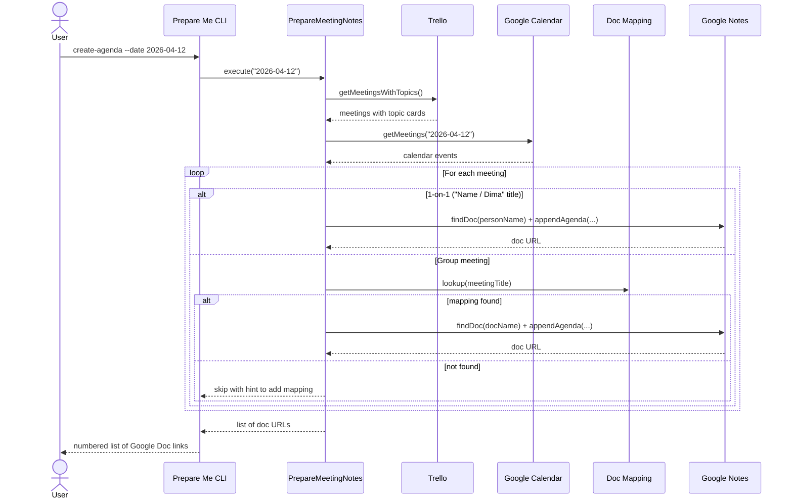

# Sequence Diagram — Create Agenda (phase 2)

```mermaid
sequenceDiagram
    actor User
    participant CLI as Prepare Me CLI
    participant UC as PrepareMeetingNotes
    participant Planner as Trello
    participant Cal as Google Calendar
    participant Mapping as Doc Mapping
    participant Notes as Google Notes

    User->>CLI: create-agenda --date 2026-04-12
    CLI->>UC: execute("2026-04-12")

    UC->>Planner: getMeetingsWithTopics()
    Planner-->>UC: meetings with topic cards

    UC->>Cal: getMeetings("2026-04-12")
    Cal-->>UC: calendar events

    loop For each meeting
        alt 1-on-1 ("Name / Dima" title)
            UC->>Notes: findDoc(personName) + appendAgenda(...)
            Notes-->>UC: doc URL
        else Group meeting
            UC->>Mapping: lookup(meetingTitle)
            alt mapping found
                UC->>Notes: findDoc(docName) + appendAgenda(...)
                Notes-->>UC: doc URL
            else not found
                UC-->>CLI: skip with hint to add mapping
            end
        end
    end

    UC-->>CLI: list of doc URLs
    CLI-->>User: numbered list of Google Doc links
```
