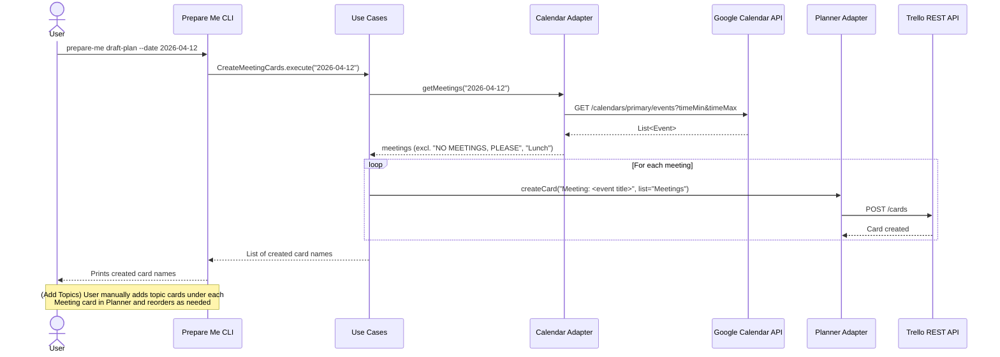

# Sequence Diagram — Draft Plan (phase 1)

```mermaid
sequenceDiagram
    actor User
    participant CLI as Prepare Me CLI
    participant UC as Use Cases
    participant Cal as Calendar Adapter
    participant GCal as Google Calendar API
    participant Planner as Planner Adapter
    participant TrelloAPI as Trello REST API

    User->>CLI: prepare-me draft-plan --date 2026-04-12
    CLI->>UC: CreateMeetingCards.execute("2026-04-12")

    UC->>Cal: getMeetings("2026-04-12")
    Cal->>GCal: GET /calendars/primary/events?timeMin&timeMax
    GCal-->>Cal: List<Event>
    Cal-->>UC: meetings (excl. "NO MEETINGS, PLEASE", "Lunch")

    loop For each meeting
        UC->>Planner: createCard("Meeting: <event title>", list="Meetings")
        Planner->>TrelloAPI: POST /cards
        TrelloAPI-->>Planner: Card created
    end

    UC-->>CLI: List of created card names
    CLI-->>User: Prints created card names

    Note over User,CLI: (Add Topics) User manually adds topic cards under each<br/>Meeting card in Planner and reorders as needed
```
